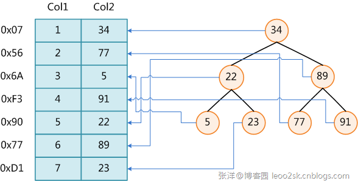
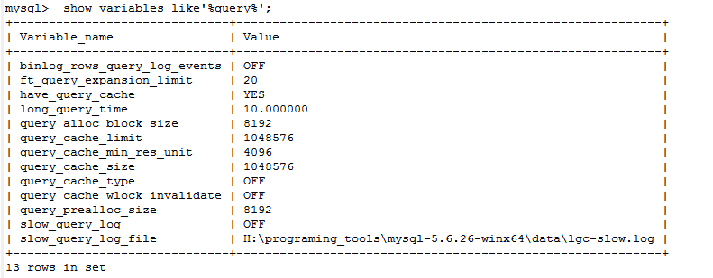
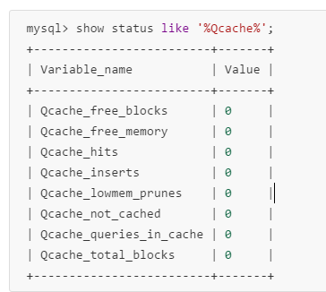
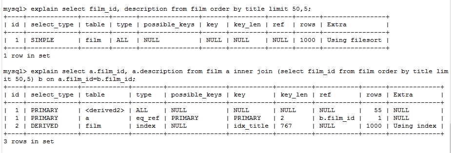

### 数据库面试题

1. #### 连接的种类

   (1)  内连接

   ```sql
   ##内连接仅选出两张表相互匹配的记录，关键字为[inner] join，可以
   ##如从employ,dept表中选取出每位雇员的名字和其对应的部门名称
   select employ_name,depart_name from employ,dept where employ.dept_id=dept.dept_id;(引用两个表的方式)
   ##或者
   select employ.employ_name,dept.depart_name from employ [inner] join dept on employ.dept_id=dept.dept_id; 
   ```

   | employ_name | depart_name |
   | ----------- | ----------- |
   | zzx         | tech        |
   | lisa        | sale        |
   | bjguan      | tech        |
   | bzshen      | hr          |

   (2)  外连接

   ```sql
   ##外连接分为左连接、右连接、全连接
   ##其中LEFT JOIN 关键字会从左表 (table_name1) 那里返回所有的行，即使在右表 (table_name2) 中没有匹配的行。
   ##RIGHT JOIN 关键字会右表 (table_name2) 那里返回所有的行，即使在左表 (table_name1) 中没有匹配的行。
   ##而FULL JOIN ，只要其中某个表存在匹配，关键字就会返回行。
   ```

   ```sql
   ##如使用left join
   select employ.employ_name,dept.depart_name from employ left join dept on employ.dept_id=dept.dept_id; 
   ##注意此时的左表指的是employ，因为employ.dept_id=dept.dept_id中，employ表格在等号左边
   ```

   | employ_name | depart_name |
   | ----------- | ----------- |
   | zzx         | tech        |
   | lisa        | sale        |
   | bjguan      | tech        |
   | bzshen      | hr          |
   | dony        |             |

   ```sql
   ##如果使用right join
   select employ.employ_name,dept.depart_name from employ right join dept on employ.dept_id=depart.dept_id; 
   ##注意，此时的右表是depart，因为depart表格在等号右边，如果此时写为：
   select employ.employ_name,dept.depart_name from employ right join dept on depart.dept_id=employ.dept_id; 
   ##则此时得到的结果和left join应该是一致的，即left join和right join可以相互转化
   ```

   | employ_name | depart_name |
   | ----------- | ----------- |
   | zzx         | tech        |
   | lisa        | sale        |
   | bjguan      | tech        |
   | bzshen      | hr          |
   |             | sale        |

   ```sql
   ##如果使用full join
   select employ.employ_name,dept.depart_name from employ full join dept on employ.dept_id=depart.dept_id; 
   ```

   | employ_name | depart_name |
   | ----------- | ----------- |
   | zzx         | tech        |
   | lisa        | sale        |
   | bjguan      | tech        |
   | bzshen      | hr          |
   | dony        |             |
   |             | sale        |

2. #### 索引

   数据库索引，是数据库管理系统中一个排序的数据结构，以协助快速查询、更新数据库表中数据。索引的实现通常使用**B树及其变种B+树**.

   

   **所有mysql类类型都可以被索引，对相关列使用索引是提高**select**操作性能的最佳途径**。mysql默认的InnoDB和MyISAM存储引擎创建的索引均是BTREE索引，Memory存储引擎默认使用的是Hash索引，但也支持BTREE索引。

   ##### 创建索引的语法为：

   ```sql
   create [unique|fulltext|spatial] index index_name [using index_type] on table_name(index_col_name,...);
   index_col_name:col_name[(length)][asc|desc]
   也可以用：
   alter table_name add index indexname on (index_col_name,...);
   ```

   ```sql
   如要为city表的city_name字段创建10个字节的前缀索引，代码如下：
   create index idx_city_name on city(city(10));
   如果以city_name为条件进行查询：select * from city where city='hangzhou';
   此时，查询该记录所用的方式为索引查询，可以利用explain关键字来得到执行该条select语句的详细信息：
   ```

   ```sql
   explain select * from city where city='hangzhou';
   ************************************************
                id: 1
       select_type: SIMPLE
             table: city
              type: ref
     possible_keys: idx_city_name ##可能使用到的索引
               key: idx_city_name ##实际使用到的索引
               ref:const
              rows:1
             Extra: Using where
          1 rows in set(0.00 sec)
   ```

   ##### 删除索引的语法为：

   ```sql
   drop index idx_city_name on city;
   ```

   ##### 设计索引的原则

   - 最适合创建索引的列是经常出现在**where**子句中的列，连接子句中指定的列，经常需要排序的列（因为索引建立的时候已经是有序的了），而不是经常出现在**select**关键字后的选择列表中的列。
   - 索引尽量具有唯一性。因为索引的实现是BTREE，如果索引不能很准确的标记某一记录，那么在对该索引所代表的列进行检索时，就不能很好的利用BTREE进行快速的查找。如，对能够唯一标记学生的学号属性建立索引，建立完成后的BTREE比较良好，可以在log(n)内查找完毕，但如果对学生的性别属性建立索引，建立完成后的索引则没有多大用处，因为不管搜索哪个值，都会得出大概一半的行，想要查找某个学生，还必须在一半的学生内继续回表逐个比对，效率肯定就会低下了。（主键本身就是按照索引的形式存储的）
   - 索引尽量短小。如，对字符串列创建索引，应该制定一个前缀长度，只要有可能就应该尽量这么做。因为较小的索引占用的存储空间较少，比较起来更快，而且涉及到的磁盘IO比较少，内存中可以容纳更多的索引键值，这样就可以一次查询更多的记录。例如：对一个char(200)的列建立索引，如果该列的前10个字符就可以大致唯一的标识出该行记录，那么就应该取前10个字符创立前缀索引，而不是对整个列建立索引。相应的，如果该列存储的是一些图片或者视频，也应该创建前缀索引，这样不仅查询更快，而且可以支持模糊查询
   - 不要过度建立索引。为表设置索引要付出代价的：一是增加了数据库的存储空间，二是在插入和修改数据时要花费较多的时间(因为索引也要随之计算并更新)。而且较多的索引，会使得mysql在查询的时候不知道哪个索引是最优的，因此应该只保留最必须的索引。

   ##### BTREE索引和HASH索引

   - HASH索引只能用于=或者<=>操作符的比较，对于其他操作符不能加速其查询过程（可以从HASH的原理很容易得知原因），而BTREE索引不仅支持=、<=>，也支持>,<,>=,<=,BETWEEN,LIKE等操作符，即支持范围查询
   - mysql优化器不能使用HASH索引来加速ORDER BY操作
   - HASH索引只能搜索某一行，查询效率接近于O(1)，比BTREE索引的查询效率要高，因此如果表格数据量不大，可以使用MEMORY存储引擎进行HASH索引的查询

   ##### 索引的种类及其创建方法

   - 普通索引

     参考上面创建索引的介绍语句

   - 唯一索引

     索引列的值必须唯一，但允许有空值。如果是组合索引，则列值的组合必须唯一，即该索引的每一个节点能够精确地表示某一行

     ```sql
     create unique index indexName on table_name(colname(length)) ;
     或者
     alter table add index index_name on (colname(length));
     或者
     create table table_name(colname1 int not null,colname2 varchar(20) not null,...,unique index index_name (colname(length)));
     ```

   - 主键索引

     它是一种特殊的唯一索引，不允许有空值。一般是在建表的时候同时创建主键索引 ，即主键，主键本身就是一种索引，如果使用InnoDB存储引擎，mysql中的数据是按照主键的顺序来排列存储的，如果没有主键，mysql会根据唯一索引排列存储，如果还没有唯一索引，mysql会根据列自动生成一个内部列，按照这个内部列的顺序排列存储。按照内部列或者主键的访问是最快的，因此应该为每个表格创建一个主键，且主键要选择尽可能短的数据类型，提高索引的缓存查询效果。

     ```sql
     create table table_name (colname1 int not null,colname2 varchar(20) not null,...,primary key(colname1));
     ```

   - 组合索引

     为了形象地对比单列索引和组合索引，为表添加多个字段：

     ```sql
     CREATE TABLE mytable(   id INT NOT NULL,    username VARCHAR(16) NOT NULL,   city VARCHAR(50) NOT NULL,   age INT NOT NULL  );
     ```

     为了进一步榨取MySQL的效率，就要考虑建立组合索引。就是将 username, city, age建到一个索引里：

     ```sql
     ALTER TABLE mytable ADD INDEX name_city_age (username(10),city,age); 	
     ```

     如果分别在 usernname，city，age上建立单列索引，让该表有3个单列索引，查询时和上述的组合索引效率也会大不一样，远远低于我们的组合索引。虽然此时有了三个索引，但MySQL只能用到其中的那个它认为似乎是最有效率的单列索引。

     建立这样的组合索引，其实是相当于分别建立了下面三组组合索引：

     **(usernname,city,age),   (usernname,city),   usernname**

     为什么没有 city，age这样的组合索引呢？这是因为MySQL组合索引“最左前缀”的结果。简单的理解就是只从最左面的开始组合,并不是只要包含这三列的查询都会用到该组合索引.

     下面的几个SQL就会用到这个组合索引：

     ```sql
     SELECT * FROM mytable WHREE username="admin" AND city="郑州"  SELECT * FROM mytable WHREE username="admin" ;
     ```

     而下面几个则不会用到：

     ```sql
     SELECT * FROM mytable WHREE age=20 AND city="郑州"  SELECT * FROM mytable WHREE city="郑州";
     ```

     虽然组合索引的查询效率要比单个的列建立的索引效果要好，但是其存储成本和维护成本也比单个的索引成本要高。

   #### 使用索引，基本上可以解决数据库95%以上的性能问题

3. #### 数据库优化步骤

   ##### 1：SQL语句优化

   1. 通过**show status**命令查询各种SQL的执行频率

      ```sql
      show status like 'com_%';
      ```

      可以得到mysql中所有语句的执行次数，我们通常比较关心的是一下几个统计参数：

      ```
      Com_select:执行select操作的次数，一次查询累加1
      Com_insert:执行insert操作的次数，对于批量插入的insert，也只累加一次
      Com_update:执行update的次数
      Com_delete:执行delete的次数
      Com_commit:事务提交的次数
      Com_rollback:事务回滚的次数
      ```

      通过这个命令可以得知，当前数据库是以插入更新为主还是以查询为主，从而确定在哪些方面进行优化。

      对于应用事务的数据库，还要看事务提交的次数和回滚的次数，如果回滚次数非常多，证明后台业务逻辑代码出现了问题，需要通知后台编程人员

      ```sql
      show status like 'slow_queries';
      ```

      通过这个语句可以得知，数据库遭遇慢查询的次数，如果次数特别多，证明数据库需要优化。

   2. 定位执行效率较低的SQL语句

      通过查询慢查询日志可以定位那些执行效率比较低的SQL语句。

      ```sql
      首先通过以下语句查看数据库是否开启了慢查询日志记录：
      show variables like'%query%';  
      ```

      

      其中long_query_time=10，指的是查询时间超过10s的就会被记录到slow_query_log中，该值可以修改。

      从图中可以得知，slow_query_log未开启，开启方法为：

      ```
      在my.ini末尾加入
      slow_query_log = 1
      long_query_time = 4
      重启mysql服务即可开启
      如果需要把没有索引的sql语句也写入到日志中，设置
      log_queries_not_using_indexes  =1 
      开启后，就会在上图slow_query_log_file的位置生成一个lgc-slow.txt的日志文件，其中lgc为mysql_master的名字。
      ```

      这样，查看慢查询日志就可以定位到执行效率比较差的sql语句

   3. 通过**explain, show profile**命令分析低效SQL语句低效的原因

      从1，2得到执行效率比较差的sql语句之后，就需要分析为什么执行效率比较差，是没有建立索引，还是索引无法使用。此时就需要分析该条语句的执行过程

      如想要统计某个email为XXX的用户为租赁电影拷贝所支付的总金额，需要关联客户表customer和付款表payment，并且对付款金额amount字段进行sum求和操作，相应的sql语句分析如下：

      ```sql
      explain select sum(amount) from payment p,customer c where c.customer_id=p.customer_id and email='xxxx@sb.com';
      ************************************************
                   id: 1
          select_type: SIMPLE
                table: p
                 type: ref
        possible_keys: idx_fk_customer_id 
                  key: idx_fk_customer_id
      		key_len: 2
                  ref: sakila.c.customer_id
                 rows: 12
                Extra: 
      ************************************************
                   id: 1
          select_type: SIMPLE
                table: c
                 type: ALL
        possible_keys: PRIMARY
                  key: NULL
      		key_len: NULL
                  ref: NULL
                 rows: 583
                Extra: Using where
             2 rows in set(0.00 sec)
      ```

      其中：

      select_type：表示select的类型，常见的取值为SIMPLE（简单表查询，即不适用表连接或者子查询），PRIMARY（主查询），UNION、SUBQUERY等

      table：输出结果的表

      type：表示mysql在表中找到所需行的方式，即访问类型

      | type          | 意义                    |
      | ------------- | --------------------- |
      | ALL           | 全表扫描                  |
      | index         | 索引全扫描                 |
      | range         | 索引范围扫描                |
      | ref           | 使用非唯一索引或唯一索引的前缀扫描     |
      | eq_ref        | 使用唯一索引扫描              |
      | const, system | 使用主键或者唯一索引进行扫描，最快速的扫描 |
      | NULL          | 不用访问表或者索引就可以得到结果      |

      possible_keys：表示查询时可能使用到的索引

      key：实际使用的索引

      key_len；使用索引的字段的长度

      rows：扫描行的数量

      Extra：执行情况的说明和描述，是判断sql语句执行速度的重要额外信息

      从explain的结果可以得知，对于表customer的扫描是全表扫描，且没有使用索引，导致查询的效率不好，所以应该对customer的customer_id字段建立索引，这样再次执行该条语句，就会有比较大的性能提升。

      如果通过explain不能得到比较好的分析结果，可以在利用show profile关键字，对该条语句执行的每个状态做分析，分析出是哪一块出了问题。如在payment表上做一个count(*)查询：

      ```sql
      set profiling=1;#profile默认是关闭的，现在打开
      mysql> select count(amount) from payment;
      +---------------+
      | count(amount) |
      +---------------+
      |         16049 |
      +---------------+
      1 row in set

      mysql> set @query_id := 4;
      Query OK, 0 rows affected

      mysql> select state,sum(duration) as total_time from information_schema.profiling where query_id=@query_id group by state order by total_time desc;
      +----------------------+------------+
      | state                | total_time |
      +----------------------+------------+
      | Sending data         | 0.007694   |
      | freeing items        | 0.000116   |
      | starting             | 0.000068   |
      | Opening tables       | 0.000037   |
      | init                 | 0.000027   |
      | cleaning up          | 0.000019   |
      | statistics           | 0.000016   |
      | preparing            | 0.000014   |
      | closing tables       | 0.000014   |
      | checking permissions | 0.000012   |
      | System lock          | 0.000010   |
      | end                  | 0.000010   |
      | query end            | 0.000009   |
      | optimizing           | 0.000007   |
      | executing            | 0.000003   |
      +----------------------+------------+
      15 rows in set
      ```

      从图中可以看出，最消耗时间的其实是sending data过程，sending data过程代表的是mysql开始访问数据行并把结果返回给客户端的一系列IO操作，经常是整个查询中最耗时的操作。

      下面就要分析sending data过程到底是哪一步最费时间，就可以执行以下语句来得到到底是cpu执行时间过长，还是因为等待前一个线程释放锁或者其他原因：

      ```sql
      show profile all for query @query_id;
      ```

      从结果（略）分析可知是sending data主要花在了cpu执行上，那么就可以针对该原因展开具体的改善措施。

      调查发现，payment表的存储引擎是InnoDB，因此没有表元数据的缓存（如count(*)的值），因此每次执行count()操作，就会导致大量的CPU操作，而Myisam存储引擎有表元数据的缓存，因此执行count()操作不需要花费很多时间，如果这里不考虑事务的话，将payment表的存储引擎改为Myisam即可显著减少sending data的时间。

   4. 确定问题后采取相应的优化措施

      通过explain一般可以解决是不是缺少索引，或者索引没有调用等sql语句的问题，如以%开头的LIKE查询就不能使用BTREE索引等

      而通过profile一般可以解决数据库是否应该开启缓存，数据库引擎设置是否得当，数据库服务器是否负载等比较大的问题

   ##### 2：应用程序编程优化
   1. 使用数据库连接池

      因为数据库建立连接的代价比较高，因此如果对于数据库的查询查询一次就建立一次连接，会使得服务器的大部分性能消耗在建立连接上。建立数据库连接池，可以很好的解决这个问题，至于框架怎么配置数据库连接池，请百度。

   2. 减少对mysql的访问

      - 避免对同一数据做重复检索

        应用中需要理清对数据库的访问逻辑，如果一次连接就能够查询到所要的结果，就不用两次连接，这样就可以大大减少对数据库无畏的访问。

        如，在某应用中查询某人的年龄和性别，那么就可以执行以下查询：

        ```sql
        select age,gender from users where userid=231;
        ```

        之后有需要这个人的家庭住址，又开始执行

        ```sql
        select address from users where userid=231;
        ```

        而这两次请求基本上是同一个业务逻辑，此时就应该将这两次查询合二为一。

      - 使用查询缓存

        查询缓存可以存储select查询的文本以及相应的结果。如果随后收到一个相同的查询，服务器会从查询缓存中重新得到查询结果，而不再需要解析和执行查询。

        查询缓存的适用对象是更新不频繁的表，当表更改（包括表结构和表数据）后，查询缓存值的相关条目被清空。查询缓存的相关参数主要有一下几个：

        


​                     have_query_cache: 表明服务器在安装时是否已经配置了高速缓存

​		     query_cache_size:  表明缓存区的大小

​	             query_cache_type: 表明缓存是否开启，0或者off代表关闭，1或者on代表开启，2或者demand代表

​                                                       只有带sql_cache的select语句才能使用缓存

​		      如果缓存没有开启，可以配置通过配置mysql中my.cnf文件来开启，具体可如下操作：

​                      1 打开my.cnf文件

​                      2 [mysqld]中添加：

​                        query_cache_size = 20M

​                        query_cache_type = ON

​                      3 重启mysql服务

​                      通过show status语句可以查看当前缓存使用的状态

​                     

#### 优化分页查询

​    一般分页查询时，通过创建覆盖索引能够比较好地提高性能。一个常见又非常头痛的分页场景是“limit 1000,20",此时mysql排序出前1020条记录后仅仅需要返回第1001到1020条记录，前1000条记录都会被抛弃，查询和排序的代价非常高。

1. 第一种思路（子查询优化法）

   在索引上完成排序分页的操作，最后根据主键关联回原表查询所需要的其他列内容。例如，对电影表film根据标题提了排序后取某一页的数据，直接查询的时候，能够从explain的输出结果中看到优化器实际上做了全表扫描，处理效率不高：

   

   第一个命令是直接查询，可以看出没有用到索引，改进后用了索引，减少了全表扫描，提高了分页查询的效率。

2. 第二种思路

   把limit查询转换为某个位置的查询。例如，假设每页10条记录，查询payment中按照租赁编号rental_id逆序排序的第42页记录，能够看到执行计划走了全表扫描

   

   和开发人员协商一下，翻页的过程中通过增加一个参数last_page_record，用来记录上一页最后一行的租赁编号rental_id，例如第41页最后一行的租赁编号rental_id=15460:

   ```sql
   select * from payment where rental_id < 15460 order by rental_id desc limt 10;
   ```

   这样，第一页查询比较慢，但其他页的查询将会比较快，而且只适用于排序字段不会出现重复值的特定环境。